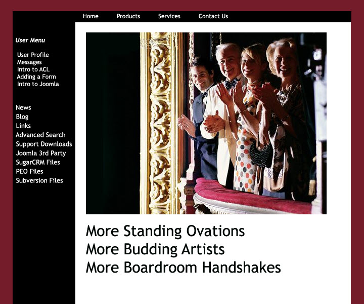

# Organizational Communications Samples

Before technical writing I created websites, wrote newsletters, edited magazines. Here are some samples:

### Proposal to Promote a CRM SoftWare for Theater Companies 

* Goal: Increase sales of CRM software by showing the advantages of using Alliance's services.

     

### Proposal to Promote a Real Estate Company that Specializes in Short Sales

* Goal: Assure potential customers of more relaxed experience when dealing with real estate short sales.

### Journal of the Louisiana State Medical Society

- Designed the covers and page layouts
- Edited the text

{.shrink}
{.shrink}

### Chronicle - Literary Journal of Clemson

### Theater Banner

* Goal: Entice the General Public to Come to the Play
* BTW, the play won a Best of Charleston Award that year

### Actor's Website

[R.W. Smith](http://jenniferpetroffsmith.me/rwsmith3/index.html)

[R.W. Smith](http://jenniferpetroffsmith.me/rwsmith3/index.html)