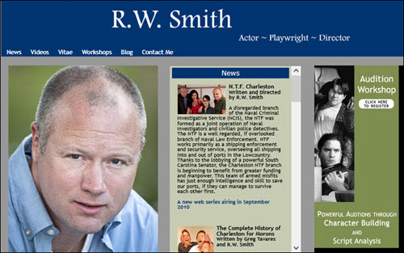

# Organizational Communications Samples

Before technical writing I created websites, wrote newsletters, edited magazines. Here are some samples:

[R.W. Smith](http://jenniferpetroffsmith.me/rwsmith3/index.html)

## Print Work

### Journal of the Louisiana State Medical Society

- Designed the covers and page layouts
- Edited the text

### Chronicle - Literary Journal of Clemson

### Theater Banner

