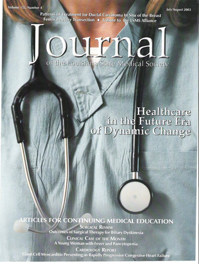

# Organizational Communications Samples

Before technical writing, I created websites, wrote newsletters, and edited magazines. Here are some samples:

## Proposal to Promote a CRM SoftWare for Theater Companies 

* Goal: Increase sales of CRM software by showing the advantages of using Alliance's services.

 
  

   
 

  

## Proposal to Promote a Real Estate Company that Specializes in Short Sales

* Goal: Assure potential customers of more relaxed experience when dealing with real estate short sales.

 
  

   
 

  

## Journal of the Louisiana State Medical Society

- Designed the covers and page layouts
- Edited the text

*Spontaneous Regression of Cervical Disc Hernication*
 

## Theater Banner

* Goal: Entice the General Public to Come to the Play
* Goal: Provide an idea of the play's plot
    * BTW, the play won a Best of Charleston Award that year!

## Actor's Website (2010)

[R.W. Smith](http://jenniferpetroffsmith.me/rwsmith3/index.html)

